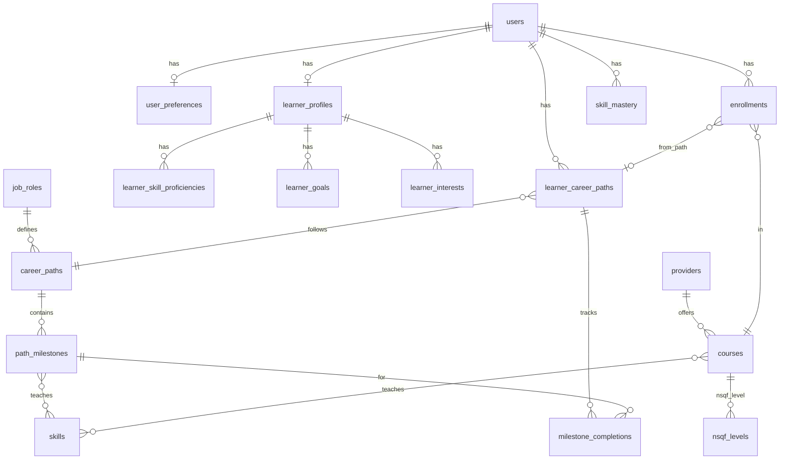

# ShikshaDisha Database Schema

Database schema for the AI-powered NSQF-integrated learning ecosystem.

---

## Table of Contents

1. [Overview](#overview)
2. [Architecture](#architecture)
3. [Entity Relationships](#entity-relationships)
4. [Tables](#tables)
5. [Indexes](#indexes)
6. [Mappings](#mappings)
7. [Integration & Migration](#integration--migration)

---

## Overview

| Domain | Tables | Purpose |
|--------|--------|---------|
| **Identity** | users, user_preferences | Accounts, auth, preferences |
| **Learner** | learner_profiles, learner_skill_proficiencies, learner_goals, learner_interests | Education, skills, goals |
| **Catalog** | skills, courses, providers, course_skills, nsqf_levels | NSQF courses, providers, skills |
| **Pathways** | job_roles, career_paths, path_milestones, path_milestone_skills | Roadmaps, milestones |
| **Progress** | learner_career_paths, enrollments, milestone_completions, skill_mastery | Enrollments, progress |
| **Engagement** | actions, learning_sessions, behavior_events, user_streaks, streak_activities | Analytics (existing) |
| **Intelligence** | labour_market_snapshots, recommendations_log | Future: LMI, recommendation tracking |

---

## Architecture

```
users
  ├── user_preferences
  ├── learner_profiles
  │     ├── learner_skill_proficiencies
  │     ├── learner_goals
  │     └── learner_interests
  ├── learner_career_paths ──► career_paths ──► job_roles
  │     └── milestone_completions ◄── path_milestones ◄── career_paths
  ├── enrollments ──► courses ◄── providers
  │                        └── course_skills ◄── skills
  ├── skill_mastery ──► skills
  └── [engagement: actions, sessions, streaks]
```

---

## Entity Relationships



---

## Tables

*Audit columns (`created_at`, `updated_at`) omitted where obvious. All IDs are `INTEGER PRIMARY KEY` unless noted.*

---

### Identity

#### users *(existing)*

| Column | Type | Constraints |
|--------|------|-------------|
| id | INTEGER | PK |
| email | VARCHAR(255) | UNIQUE, NOT NULL |
| name | VARCHAR(255) | |
| language | VARCHAR(10) | DEFAULT 'en' |
| created_at | TIMESTAMP | |

#### user_preferences

| Column | Type | Constraints |
|--------|------|-------------|
| id | INTEGER | PK |
| user_id | INTEGER | FK(users.id), UNIQUE |
| learning_style | VARCHAR(50) | visual \| auditory \| kinesthetic \| reading |
| collaborative_learning | BOOLEAN | |
| time_commitment_hours_week | DECIMAL(4,2) | |
| timeline_months | INTEGER | |
| gamification_enabled | BOOLEAN | DEFAULT true |
| reminder_enabled | BOOLEAN | DEFAULT true |
| preferred_languages | JSONB | |
| accessibility_needs | JSONB | |
| created_at, updated_at | TIMESTAMP | |

---

### Learner

#### learner_profiles

| Column | Type | Constraints |
|--------|------|-------------|
| id | INTEGER | PK |
| user_id | INTEGER | FK(users.id), UNIQUE |
| education_level | VARCHAR(50) | 10th \| 12th \| Diploma \| Degree \| PostGrad |
| field_of_study | VARCHAR(255) | |
| experience_years | DECIMAL(4,2) | DEFAULT 0 |
| location | VARCHAR(255) | |
| region | VARCHAR(100) | |
| target_industries | JSONB | |
| target_roles | TEXT | |
| headline | VARCHAR(500) | |
| has_resources | BOOLEAN | |
| motivations | JSONB | |
| comfortable_subjects | JSONB | |
| onboarding_completed_at | TIMESTAMP | |
| created_at, updated_at | TIMESTAMP | |

#### learner_skill_proficiencies

| Column | Type | Constraints |
|--------|------|-------------|
| id | INTEGER | PK |
| learner_profile_id | INTEGER | FK(learner_profiles.id) |
| skill_name | VARCHAR(255) | |
| proficiency_level | INTEGER | CHECK (1–5) |
| source | VARCHAR(50) | onboarding \| inferred \| assessed |
| created_at | TIMESTAMP | |
| **UNIQUE** | (learner_profile_id, skill_name) | |

#### learner_goals

| Column | Type | Constraints |
|--------|------|-------------|
| id | INTEGER | PK |
| learner_profile_id | INTEGER | FK(learner_profiles.id) |
| goal_type | VARCHAR(50) | learning \| career \| certification |
| value | TEXT | |
| priority | INTEGER | 1=primary, 2=secondary |
| created_at | TIMESTAMP | |

#### learner_interests

| Column | Type | Constraints |
|--------|------|-------------|
| id | INTEGER | PK |
| learner_profile_id | INTEGER | FK(learner_profiles.id) |
| interest | VARCHAR(255) | |
| created_at | TIMESTAMP | |

---

### Catalog

#### nsqf_levels

| Column | Type | Constraints |
|--------|------|-------------|
| level | INTEGER | PK (1–10) |
| description | VARCHAR(255) | |
| typical_entry | VARCHAR(255) | |

#### providers

| Column | Type | Constraints |
|--------|------|-------------|
| id | INTEGER | PK |
| name | VARCHAR(255) | NOT NULL |
| slug | VARCHAR(100) | UNIQUE |
| region | VARCHAR(100) | |
| website_url | VARCHAR(500) | |
| is_nsqf_aligned | BOOLEAN | DEFAULT true |
| created_at, updated_at | TIMESTAMP | |

#### skills

| Column | Type | Constraints |
|--------|------|-------------|
| id | INTEGER | PK |
| name | VARCHAR(255) | UNIQUE |
| category | VARCHAR(100) | technical \| soft \| foundational |
| keywords | JSONB | |
| created_at | TIMESTAMP | |

#### courses

| Column | Type | Constraints |
|--------|------|-------------|
| id | INTEGER | PK |
| course_id | VARCHAR(50) | UNIQUE (external ID, e.g. C001) |
| title | VARCHAR(500) | NOT NULL |
| description | TEXT | |
| nsqf_level | INTEGER | FK(nsqf_levels.level) |
| duration_months | INTEGER | |
| language | VARCHAR(20) | DEFAULT 'en' |
| region | VARCHAR(100) | |
| provider_id | INTEGER | FK(providers.id) |
| keywords | JSONB | |
| enrollment_count | INTEGER | DEFAULT 0 |
| completion_rate | DECIMAL(5,2) | |
| created_at, updated_at | TIMESTAMP | |

#### course_skills *(M:N)*

| Column | Type | Constraints |
|--------|------|-------------|
| course_id | INTEGER | FK(courses.id) |
| skill_id | INTEGER | FK(skills.id) |
| is_primary | BOOLEAN | DEFAULT false |
| **PK** | (course_id, skill_id) | |

---

### Pathways

#### job_roles

| Column | Type | Constraints |
|--------|------|-------------|
| id | INTEGER | PK |
| title | VARCHAR(255) | NOT NULL |
| slug | VARCHAR(100) | UNIQUE |
| description | TEXT | |
| typical_salary_range | VARCHAR(100) | |
| industry | VARCHAR(100) | |
| demand_level | VARCHAR(50) | high \| medium \| low |
| created_at, updated_at | TIMESTAMP | |

#### career_paths

| Column | Type | Constraints |
|--------|------|-------------|
| id | INTEGER | PK |
| job_role_id | INTEGER | FK(job_roles.id) |
| title | VARCHAR(255) | |
| duration_months_min, duration_months_max | INTEGER | |
| level_start, level_end | VARCHAR(50) | |
| is_template | BOOLEAN | DEFAULT true |
| created_at, updated_at | TIMESTAMP | |

#### path_milestones

| Column | Type | Constraints |
|--------|------|-------------|
| id | INTEGER | PK |
| career_path_id | INTEGER | FK(career_paths.id) |
| sequence | INTEGER | |
| title | VARCHAR(255) | NOT NULL |
| type | VARCHAR(50) | onboarding \| course \| internship \| certification \| job |
| description | TEXT | |
| duration_weeks | INTEGER | |
| provider_id | INTEGER | FK(providers.id), nullable |
| course_id | INTEGER | FK(courses.id), nullable |
| level | VARCHAR(50) | |
| resources, next_steps | TEXT, JSONB | |
| salary_info | VARCHAR(255) | for type=job |
| companies | JSONB | for type=job |
| created_at, updated_at | TIMESTAMP | |

#### path_milestone_skills *(M:N)*

| Column | Type | Constraints |
|--------|------|-------------|
| path_milestone_id | INTEGER | FK(path_milestones.id) |
| skill_id | INTEGER | FK(skills.id) |
| **PK** | (path_milestone_id, skill_id) | |

---

### Progress

#### learner_career_paths

| Column | Type | Constraints |
|--------|------|-------------|
| id | INTEGER | PK |
| user_id | INTEGER | FK(users.id) |
| career_path_id | INTEGER | FK(career_paths.id) |
| job_role_id | INTEGER | FK(job_roles.id) |
| match_score | DECIMAL(5,2) | 0–100 |
| status | VARCHAR(50) | active \| completed \| paused |
| started_at, target_completion_at, completed_at | TIMESTAMP | |
| created_at, updated_at | TIMESTAMP | |

#### enrollments

| Column | Type | Constraints |
|--------|------|-------------|
| id | INTEGER | PK |
| user_id | INTEGER | FK(users.id) |
| course_id | INTEGER | FK(courses.id) |
| status | VARCHAR(50) | enrolled \| in_progress \| completed \| dropped |
| enrolled_at, started_at, completed_at | TIMESTAMP | |
| progress_percent | INTEGER | DEFAULT 0, 0–100 |
| source | VARCHAR(50) | recommendation \| manual \| career_path |
| learner_career_path_id | INTEGER | FK(learner_career_paths.id), nullable |
| created_at, updated_at | TIMESTAMP | |

#### milestone_completions

| Column | Type | Constraints |
|--------|------|-------------|
| id | INTEGER | PK |
| user_id | INTEGER | FK(users.id) |
| path_milestone_id | INTEGER | FK(path_milestones.id) |
| learner_career_path_id | INTEGER | FK(learner_career_paths.id) |
| status | VARCHAR(50) | completed \| in_progress \| upcoming |
| progress_percent | INTEGER | DEFAULT 0 |
| completed_at | TIMESTAMP | nullable |
| created_at, updated_at | TIMESTAMP | |
| **UNIQUE** | (user_id, path_milestone_id, learner_career_path_id) | |

#### skill_mastery

| Column | Type | Constraints |
|--------|------|-------------|
| id | INTEGER | PK |
| user_id | INTEGER | FK(users.id) |
| skill_id | INTEGER | FK(skills.id) |
| level | INTEGER | 0–100 |
| source | VARCHAR(50) | inferred \| assessed \| course_completion |
| last_updated | TIMESTAMP | |
| **UNIQUE** | (user_id, skill_id) | |

---

### Engagement *(existing)*

- **users** — base record
- **actions** — generic events (e.g. `skill_completed`, `course_recommendation_clicked`)
- **notifications** — push/in-app
- **devices** — push tokens
- **learning_sessions** — session metrics, engagement, dropout risk
- **behavior_events** — granular session events
- **user_engagement_profiles** — aggregated engagement
- **user_streaks** — streak counters
- **streak_activities** — daily activity log

---

### Intelligence *(future)*

#### labour_market_snapshots

| Column | Type |
|--------|------|
| id | INTEGER PK |
| skill_id | INTEGER FK(skills.id) |
| region | VARCHAR(100) |
| demand_score | DECIMAL(5,2) |
| salary_trend | VARCHAR(50) |
| snapshot_date | DATE |
| created_at | TIMESTAMP |

#### recommendations_log

| Column | Type |
|--------|------|
| id | INTEGER PK |
| user_id | INTEGER FK(users.id) |
| recommendation_type | VARCHAR(50) |
| entity_id, entity_type | INTEGER, VARCHAR(50) |
| rank, match_score | INTEGER, DECIMAL(5,2) |
| clicked | BOOLEAN DEFAULT false |
| created_at | TIMESTAMP |

---

## Indexes

```sql
-- Learner
CREATE INDEX idx_learner_profiles_user_id ON learner_profiles(user_id);
CREATE INDEX idx_learner_skill_proficiencies_profile ON learner_skill_proficiencies(learner_profile_id);

-- Catalog
CREATE INDEX idx_courses_nsqf_region ON courses(nsqf_level, region);
CREATE INDEX idx_courses_provider ON courses(provider_id);
CREATE INDEX idx_course_skills_skill ON course_skills(skill_id);

-- Progress
CREATE INDEX idx_enrollments_user_status ON enrollments(user_id, status);
CREATE INDEX idx_enrollments_course ON enrollments(course_id);
CREATE INDEX idx_milestone_completions_user_path ON milestone_completions(user_id, learner_career_path_id);
CREATE INDEX idx_learner_career_paths_user ON learner_career_paths(user_id);

-- Pathways
CREATE INDEX idx_path_milestones_path ON path_milestones(career_path_id);
```

---

## Mappings

### Onboarding → Schema

| Form Field | Target |
|------------|--------|
| fullName | users.name |
| contact | users.email (or user_contacts) |
| education | learner_profiles.education_level |
| fieldOfStudy | learner_profiles.field_of_study |
| proficiency_* (5 skills) | learner_skill_proficiencies |
| skills (checkboxes) | learner_skill_proficiencies |
| interests | learner_interests |
| learningGoals | learner_goals |
| targetRoles | learner_profiles.target_roles |
| targetIndustries | learner_profiles.target_industries |
| learningTypes | learner_goals |
| learningStyle | user_preferences.learning_style |
| collaborativeLearning | user_preferences.collaborative_learning |
| timeCommitment | user_preferences.time_commitment_hours_week |
| timeline | user_preferences.timeline_months |
| motivations | learner_profiles.motivations |
| hasResources | learner_profiles.has_resources |
| reminders | user_preferences.reminder_enabled |
| gamification | user_preferences.gamification_enabled |
| comfortableSubjects | learner_profiles.comfortable_subjects |

---

## Integration & Migration

| Service | Tables |
|---------|--------|
| **actions_service** | users, actions, notifications, devices, learning_sessions, behavior_events, user_engagement_profiles, user_streaks, streak_activities |
| **ai_engine_service** | learner_profiles, courses, skills (Profile schema + nsqf_courses.csv) |

**Recommendation:** Single PostgreSQL DB with schemas `identity`, `learner`, `catalog`, `progress`, `engagement`; or separate services per domain sharing the DB.

**Migration order:**

1. Create catalog tables; seed `nsqf_levels`, `providers`, `skills`; load `nsqf_courses.csv` → `courses`, `course_skills`.
2. Create learner tables; add profile APIs.
3. Create pathway and progress tables; add enrollment and milestone APIs.
4. Point AI engine at DB instead of CSV.
